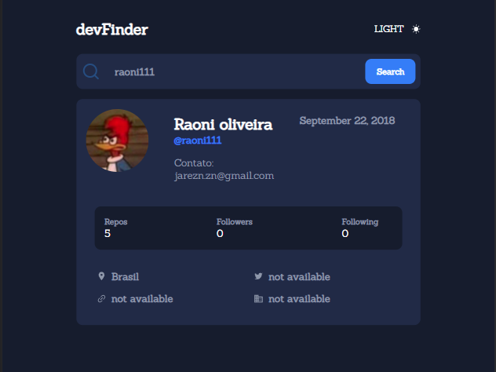
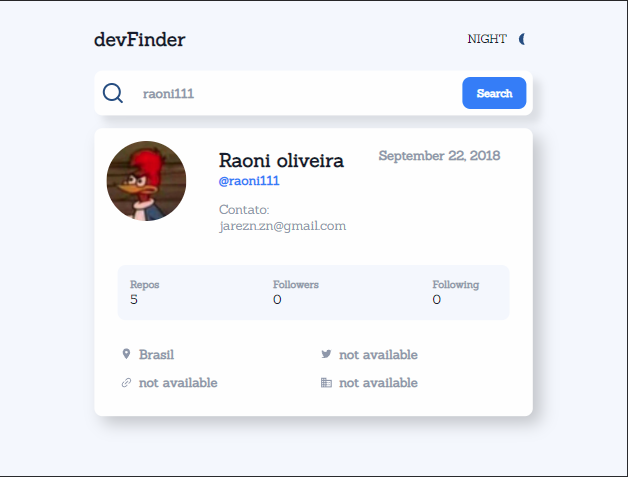

<section>
  <h1>
    <a href="https://devfinderbyraoni.netlify.app/">DevFinder</a>
  </h1>
  
esse projeto e um resolução do desafio do Frontend Mentor, 100% feito por mim.   Esse projeto tem dois temas sendo o escuro e o claro, e tem responsividade com a maioria     dos dispositivos da atualidade

  <h1 align="center">Tema escuro</h1>
  

    
  

  <h1 align="center">Tema claro</h1>
  

    
  

</section>
